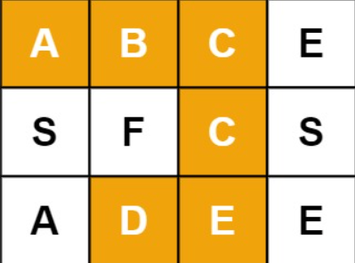
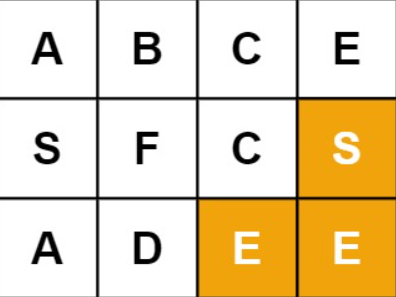
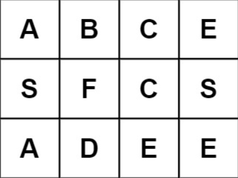

## 问题
给定一个 m x n 二维字符网格 board 和一个字符串单词 word 。如果 word 存在于网格中，返回 true ；否则，返回 false 。

单词必须按照字母顺序，通过相邻的单元格内的字母构成，其中“相邻”单元格是那些水平相邻或垂直相邻的单元格。同一个单元格内的字母不允许被重复使用。

示例 1：



输入：board = [["A","B","C","E"],["S","F","C","S"],["A","D","E","E"]], word = "ABCCED"
输出：true

示例 2：



输入：board = [["A","B","C","E"],["S","F","C","S"],["A","D","E","E"]], word = "SEE"
输出：true

示例 3：



输入：board = [["A","B","C","E"],["S","F","C","S"],["A","D","E","E"]], word = "ABCB"
输出：false

## 思路
回溯法经典问题，通过将搜索路径和Word中的第N个字母进行比对来减枝，如果用栈写，需要额外开一个map来记录路径，内存会爆。大多数情况下回溯法的问题还是递归更灵活，消耗的内存也更小。

## 代码

```
/**
 * @param {character[][]} board
 * @param {string} word
 * @return {boolean}
 */

var exist = function(board, word) {
    let boardMap = {};

    function checkPath (rowIndex, columnIndex, pathLenth, str) {
        if (rowIndex < 0 ||
            rowIndex >= board.length ||
            columnIndex < 0 ||
            columnIndex >= board[0].length ||
            board[rowIndex][columnIndex] !== word[pathLenth] ||
            boardMap[`${rowIndex}-${columnIndex}`]) {
            return false;
        }

        boardMap[`${rowIndex}-${columnIndex}`] = true;
        pathLenth ++;
        str += board[rowIndex][columnIndex];

        if (pathLenth === word.length ||
            checkPath (rowIndex + 1, columnIndex, pathLenth, str) ||
            checkPath (rowIndex - 1, columnIndex, pathLenth, str) ||
            checkPath (rowIndex, columnIndex + 1, pathLenth, str) ||
            checkPath (rowIndex, columnIndex - 1, pathLenth, str)) {
            return true;
        }

        boardMap[`${rowIndex}-${columnIndex}`] = false;

        return false;
    } 

    for (let row = 0; row < board.length; row ++) {
        for (let column = 0; column < board[0].length; column ++) {
           if (checkPath (row, column, 0, '')) {
               return true;
           }
        }
    }
    
    return false;
};
```